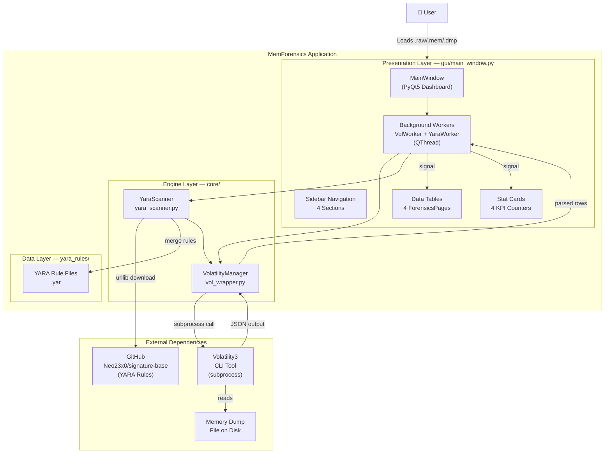
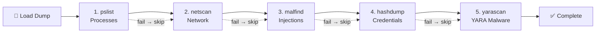
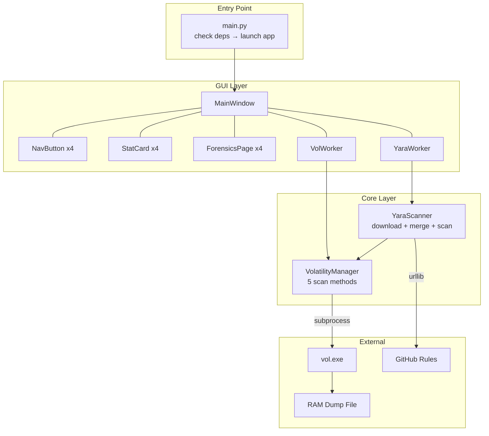

# 🧠 MemForensics — System Architecture

---

## High-Level Architecture

```mermaid
graph TB
    USER["👤 User"] -->|"Loads .raw/.mem/.dmp"| GUI

    subgraph APP["MemForensics Application"]

        subgraph GUI["Presentation Layer — gui/main_window.py"]
            MAIN_WIN["MainWindow\n(PyQt5 Dashboard)"]
            SIDEBAR["Sidebar Navigation\n4 Sections"]
            CARDS["Stat Cards\n4 KPI Counters"]
            TABLES["Data Tables\n4 ForensicsPages"]
            THREADS["Background Workers\nVolWorker + YaraWorker\n(QThread)"]
        end

        subgraph CORE["Engine Layer — core/"]
            VOL_WRAP["VolatilityManager\nvol_wrapper.py"]
            YARA_MGR["YaraScanner\nyara_scanner.py"]
        end

        subgraph DATA["Data Layer — yara_rules/"]
            RULES["YARA Rule Files\n.yar"]
        end

    end

    subgraph EXT["External Dependencies"]
        VOL3["Volatility3\nCLI Tool\n(subprocess)"]
        GITHUB["GitHub\nNeo23x0/signature-base\n(YARA Rules)"]
        DUMP["Memory Dump\nFile on Disk"]
    end

    MAIN_WIN --> THREADS
    THREADS --> VOL_WRAP
    THREADS --> YARA_MGR
    VOL_WRAP -->|"subprocess call"| VOL3
    VOL3 -->|"reads"| DUMP
    VOL3 -->|"JSON output"| VOL_WRAP
    YARA_MGR -->|"urllib download"| GITHUB
    YARA_MGR -->|"merge rules"| RULES
    YARA_MGR --> VOL_WRAP
    VOL_WRAP -->|"parsed rows"| THREADS
    THREADS -->|"signal"| TABLES
    THREADS -->|"signal"| CARDS
```

---

## Pipeline Architecture

```mermaid
graph LR
    LOAD["📂 Load Dump"] --> P1["1. pslist\nProcesses"] --> P2["2. netscan\nNetwork"] --> P3["3. malfind\nInjections"] --> P4["4. hashdump\nCredentials"] --> P5["5. yarascan\nYARA Malware"] --> DONE["✅ Complete"]

    P1 -.->|"fail → skip"| P2
    P2 -.->|"fail → skip"| P3
    P3 -.->|"fail → skip"| P4
    P4 -.->|"fail → skip"| P5
```

---

## Component Interaction

```mermaid
graph TD
    subgraph ENTRY["Entry Point"]
        MAIN_PY["main.py\ncheck deps → launch app"]
    end

    subgraph GUI_LAYER["GUI Layer"]
        MW["MainWindow"] --- NAV["NavButton x4"]
        MW --- SC["StatCard x4"]
        MW --- FP["ForensicsPage x4"]
        MW --- VW["VolWorker"]
        MW --- YW["YaraWorker"]
    end

    subgraph CORE_LAYER["Core Layer"]
        VM["VolatilityManager\n5 scan methods"]
        YS["YaraScanner\ndownload + merge + scan"]
    end

    subgraph EXTERNAL_LAYER["External"]
        VOL["vol.exe"]
        GH["GitHub Rules"]
        MEM["RAM Dump File"]
    end

    MAIN_PY --> MW
    VW --> VM
    YW --> YS
    YS --> VM
    VM -->|subprocess| VOL
    YS -->|urllib| GH
    VOL --> MEM
```
