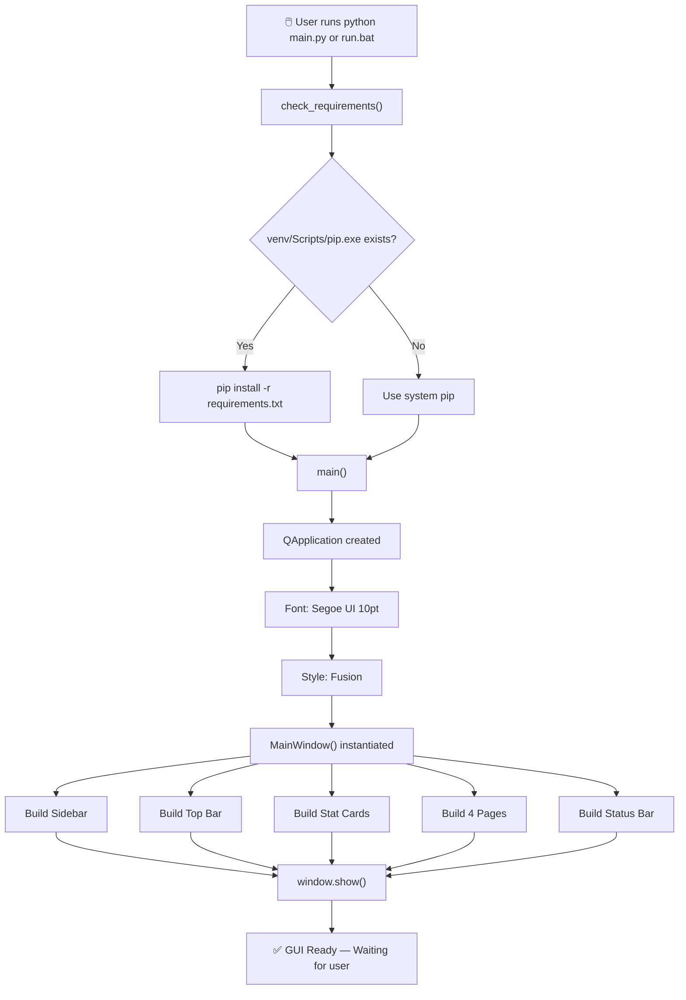
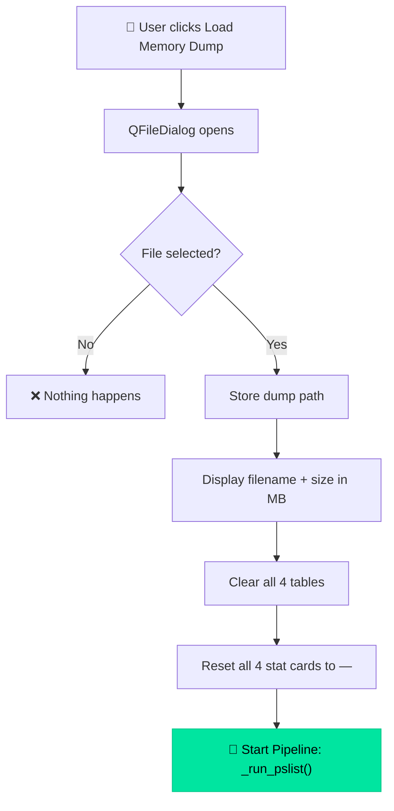
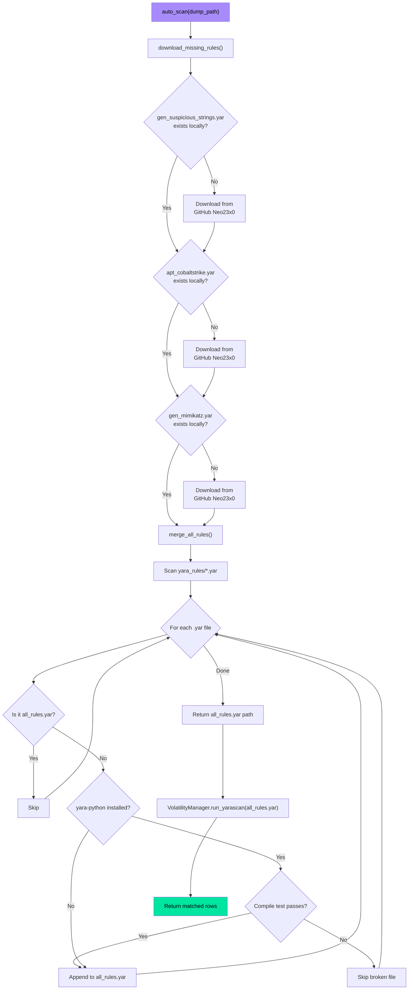
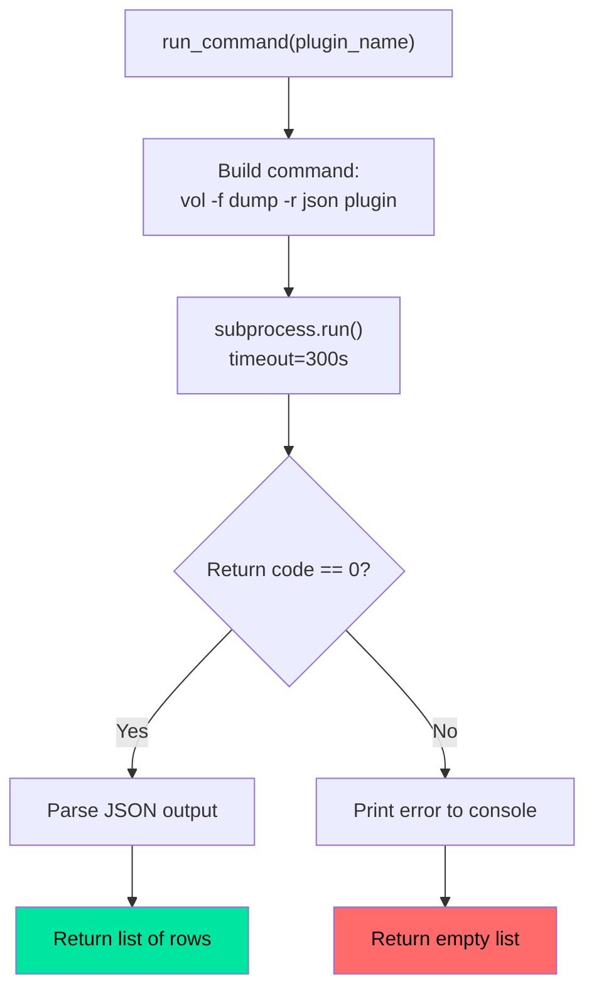
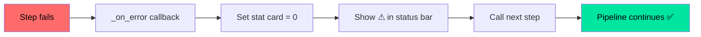
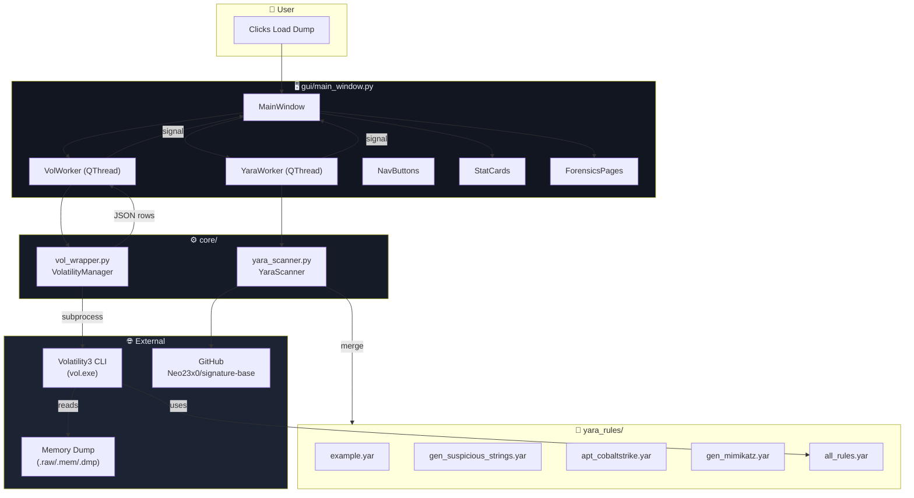

# 🔄 MemForensics — Flow Diagrams

---

## 1. Application Startup Flow

---

## 2. Memory Dump Loading Flow

---

## 3. The 5-Step Analysis Pipeline

```mermaid
flowchart TD
    START["📂 Memory Dump Loaded"] --> S1

    subgraph S1["Step 1/5 — Process Extraction"]
        S1A["VolWorker Thread starts"] --> S1B["vol -f dump -r json windows.pslist.PsList"]
        S1B --> S1C{"Success?"}
        S1C -->|Yes| S1D["Populate Processes table\nUpdate stat card"]
        S1C -->|No| S1E["Log warning\nCard = 0"]
    end

    S1D --> S2
    S1E --> S2

    subgraph S2["Step 2/5 — Network Recovery"]
        S2A["VolWorker Thread starts"] --> S2B["vol -f dump -r json windows.netscan.NetScan"]
        S2B --> S2C{"Success?"}
        S2C -->|Yes| S2D["Populate Network table\nUpdate stat card"]
        S2C -->|No| S2E["Log warning\nCard = 0"]
    end

    S2D --> S3
    S2E --> S3

    subgraph S3["Step 3/5 — Injection Detection"]
        S3A["VolWorker Thread starts"] --> S3B["vol -f dump -r json windows.malfind.Malfind"]
        S3B --> S3C{"Success?"}
        S3C -->|Yes| S3D["Populate Malware table\nSave rows for later"]
        S3C -->|No| S3E["Log warning\nCard = 0"]
    end

    S3D --> S4
    S3E --> S4

    subgraph S4["Step 4/5 — Credential Recovery"]
        S4A["VolWorker Thread starts"] --> S4B["vol -f dump -r json windows.hashdump"]
        S4B --> S4C{"Success?"}
        S4C -->|Yes| S4D["Populate Credentials table\nUpdate stat card"]
        S4C -->|No| S4E["Log warning\nCard = 0"]
    end

    S4D --> S5
    S4E --> S5

    subgraph S5["Step 5/5 — YARA Signature Scan"]
        S5A["YaraWorker Thread starts"] --> S5B["Download missing rules\nfrom GitHub"]
        S5B --> S5C["Merge all .yar → all_rules.yar"]
        S5C --> S5D["vol -f dump -r json windows.yarascan.YaraScan\n--yara-file all_rules.yar"]
        S5D --> S5E{"Success?"}
        S5E -->|Yes| S5F["Append YARA matches\nto Malware table"]
        S5E -->|No| S5G["Skip YARA results"]
    end

    S5F --> DONE
    S5G --> DONE

    DONE["✅ Pipeline Complete\nAll 5 scans finished"]

    style START fill:#6CB4EE,color:#000
    style DONE fill:#00E5A0,color:#000
```

---

## 4. YARA Scanner Internal Flow

---

## 5. Volatility Command Execution Flow

---

## 6. Error Handling Strategy

---

## 7. Overall Architecture

